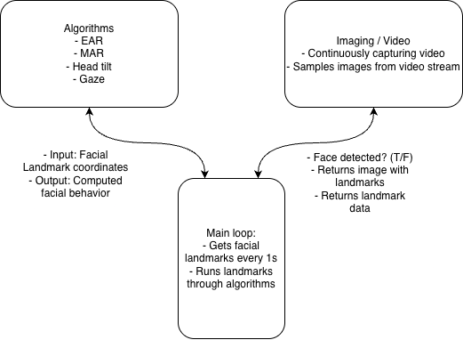
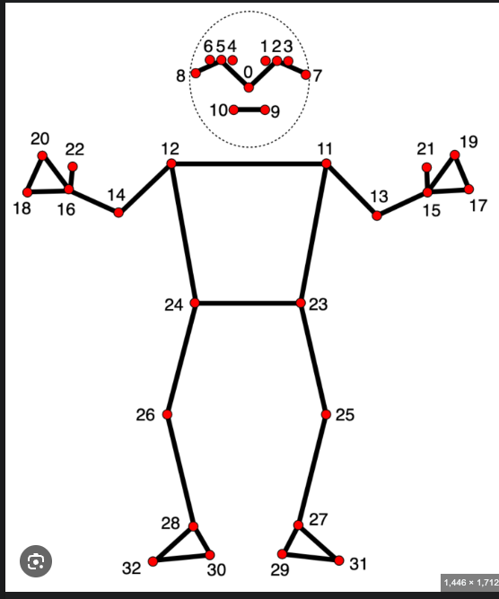

### Facial-Orientation and Concentration Understanding System (FOCUS)
Bryan Melendez \
Matthew Quach \
Aileen Kim

### Google Doc
https://docs.google.com/document/d/1MGbXtYIxtO_Ngv6nXu83LEVJaTslGELuwQzDdMLm7g0/edit?tab=t.0

### Development Program Structure


### Instruction
- install pyenv ```brew install pyenv```
- install python 3.12 ```brew install python@3.12```
- run ```source setup_env.sh``` to setup the python virtual environment
- run ```source .venv/bin/activate``` if venv did not activate for some reason
- environment should be set up now
- to run the code, run ```./run.sh``` which just runs the main.py file

### Packages
- If a python library is needed, install using ```python -m pip install <package_name>```
- then, export the package list using ```./export_env.sh```
- this will write all installed libraries into the requirements.txt list
- then push the requirements list to github
- then everyone else on the team should run ```./setup_env.sh``` again

### Development Rules
- When implementing a new feature, make a new branch and name it ```feature/<name of feature>```
- When it is done and tested, merge it into develop (tell me if you don't know how to do this or ask chatgpt)
- Only merge anything onto ```main``` if we have discussed it and decide that it is okay

### Branches
- ```develop``` will be the base branch we will use for developing our algorithms. so when developing a new feature, branch off of here 
- ```demo``` was used for our initial CV + Facial Landmark demo
- ```main``` will be used later when we actually start making the app so please don't push anything onto there yet

### Numpy
